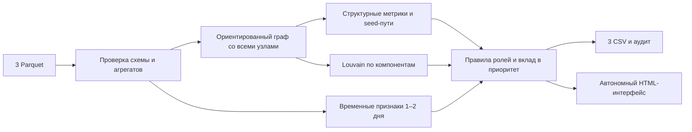

# MoneyGraph · HackAlem AI

Локальный MVP для трека **«Граф денег: восстановление финансовой структуры организованной группы по транзакционной сети»**.

Три Parquet-файла превращаются в объяснимые роли всех участников, кластеры, список приоритетов и интерактивную карту. Основной вопрос: **кого проверить первым и какие наблюдения это обосновывают?**

Это инструмент поддержки аналитика. Роли — гипотезы, `role_score` — сила формальных признаков, `priority_score` — приоритет проверки. Ни один скор не является вероятностью виновности. Реальные остатки на счетах и происхождение конкретных денег по этой выгрузке не восстанавливаются.

## Быстрый старт

Нужен **Python 3.12**. Рабочая директория во всех командах — корень проекта.

### Windows / PowerShell

```powershell
py -3.12 -m venv .venv
.\.venv\Scripts\python.exe -m pip install -r requirements.txt
```

Распакуйте архив организаторов `data (1).zip` в корень проекта. Должно получиться именно:

```text
data/
  nodes.parquet
  edges.parquet
  transactions.parquet
```

**Один запуск от сырых данных до всех результатов и интерфейса:**

```powershell
.\.venv\Scripts\python.exe run.py --data data --out results --serve --open
```

Откроется `http://127.0.0.1:8765/dashboard.html`. Остановка сервера: `Ctrl+C`. Активация окружения не требуется; менять PowerShell ExecutionPolicy не нужно.

### macOS / Linux

```bash
python3.12 -m venv .venv
.venv/bin/python -m pip install -r requirements.txt
.venv/bin/python run.py --data data --out results --serve --open
```

Для расчёта без сервера: `python run.py --data data --out results`. После него `results/dashboard.html` можно открыть двойным щелчком: данные, стили и код включены в HTML, CDN и интернет не требуются.

Интернет нужен только при первой установке библиотек. Для полностью офлайн-машины заранее подготовьте wheelhouse под её ОС и Python: `python -m pip download -r requirements.txt -d wheelhouse`, затем `python -m pip install --no-index --find-links wheelhouse -r requirements.txt`.

### Проверка без закрытого датасета

```bash
python scripts/make_demo.py --out data-demo
python run.py --data data-demo --out results --serve
```

Генератор создаёт **полностью вымышленные** узлы и переводы, включая изолированный seed, четвёртое колено, веер и транзит. Это данные для демонстрации и CI, не замена датасету хакатона.

## Что готово

| Требование | Реализация |
|---|---|
| Воспроизводимый пайплайн < 5 минут | `run.py`, закреплённые версии, проверка входа и выхода, SHA-256 входных файлов |
| Роль у каждого узла | Все `nodes.gid`, включая изолированные; шесть ролей обязательного словаря |
| Формальные объяснения | Пороги в `config.json`, методика ниже и в `docs/METHODOLOGY.md`; числовое `evidence` ≤ 200 символов |
| Кластеры | Louvain по отдельным компонентам, включая singleton-кластеры изолятов |
| Топ ≥ 20 | По умолчанию топ-50, отдельное объяснение вкладов факторов |
| Визуализация | Стрелки, роли/кластеры, поиск точного gid, карточки, масштабирование и фильтры |
| Учёт обрыва | Узлы depth=4 с нулевым выходом не получают `terminal`; положительные признаки входа сохраняются |
| Временные паттерны | FIFO-совместимость за 1–2 дня, синхронные плательщики, доля пикового дня |
| Структурный сценарий | Достижимость от seed при исключении топ-1/3/5 |
| Чувствительность выводов | Отдельный отчёт по сдвигу порогов ролей и весов приоритета |
| Воспроизводимость | Тесты `unittest`, GitHub Actions на Windows и Linux с вымышленными данными |

В MVP нет внешнего LLM, GPU, платных API и обучения с размеченными ролями. Используются объяснимые правила и кластеризация без учителя. Нельзя заявлять accuracy: истинные роли не размечены. LLM-ассистент не обязателен по ТЗ и не нужен для корректного расчёта.

## Выходные файлы

| Файл | Содержимое |
|---|---|
| `nodes_roles.csv` | `gid, role, role_score, cluster_id, priority_score, evidence`, далее наблюдаемые метрики |
| `clusters.csv` | `cluster_id, n_nodes, n_seed, sum_kzt_internal, top_gids, hypothesis` |
| `top_nodes.csv` | `rank, gid, role, priority_score, why`; минимум 20 при наличии ≥20 узлов |
| `dashboard.html` | Полностью автономный интерактивный интерфейс |
| `graph.json` | Данные интерфейса, альтернативные роли, временные ряды, сценарии |
| `audit.json` | Объёмы, проверки, ограничения, распределение ролей, время расчёта |
| `manifest.json` | Параметры, версии Python/библиотек, хеши входных Parquet |
| `sensitivity.json` | Дополнительный отчёт устойчивости, создаётся отдельной командой ниже |

CSV — UTF-8 с BOM, разделитель запятая. `gid` в CSV хранится точной десятичной записью int64. **При импорте в Excel выберите для gid тип «Текст»**: Excel округляет длинные числа. В JSON и браузере gid — строки, потому что эти значения больше точного целочисленного диапазона JavaScript.

`top_gids` — до пяти gid через `;`, по убыванию приоритета. Внутренний оборот кластера считает каждое направленное ребро один раз. Сумма внутренних оборотов может быть меньше общего оборота из-за межкластерных переводов.

Проверить произвольный узел без браузера:

```bash
python run.py --out results --explain <полный_gid>
```

### Проверка чувствительности

После подготовки данных запустите `python -m scripts.sensitivity --data data --out results/sensitivity.json` (в Windows можно использовать `./.venv/Scripts/python.exe` вместо `python`). Команда отдельно пересчитывает роли при изменении порога числа плательщиков и получателей на ±1 и проверяет состав топ-20 при изменении каждого веса приоритета на ±20% с нормировкой общей суммы весов. В JSON указаны gid с изменившейся ролью и вошедшие/выбывшие из топа. Это проверка зависимости от настроек, а не измерение точности без истинных меток. Основные CSV и интерфейс команда не меняет.

## Формальные правила ролей

`I`, `O` — суммы наблюдаемого входа/выхода; `din`, `dout` — число разных контрагентов. `R=O/I`, только при `I>0`. Для seed и обрезанных узлов R **не участвует** в назначении транзита/стока.

| Роль | Условие допуска по умолчанию |
|---|---|
| `consolidator` | `din ≥ 3` |
| `distributor` | `dout ≥ 10` |
| `transit` | Не seed, не обрыв, `I>0`, `dout>0`, `0.8 ≤ R ≤ 1.2` |
| `terminal` | Не seed, не обрыв, `I>0`, `R ≤ 0.1`, есть вход до последних двух дней и нет входа в последние два дня |
| `coordinator` | Не обрыв; `din≥2`, `dout≥2`; направленные пути от ≥2 разных seed; соседи в ≥2 внешних кластерах; положительное посредничество ≥P90 положительных значений |
| `peripheral` | Ни одно из правил не выполнено; означает недостаток признаков, а не безопасность клиента |

Допущенные роли получают собственный скор. `coordinator` имеет приоритет как более специфический структурный паттерн; иначе выбирается максимальный скор. Альтернативные роли сохраняются и видны в карточке. Формулы и tie-break описаны в [методике](docs/METHODOLOGY.md).

Координатор в интерфейсе назван **«кандидат-мост»**: центральность сама по себе не доказывает управление группой. `terminal` отображается как **«гипотеза стока»**. Даже внутри глубины 4 невозможно доказать, что деньги остались на счёте: отсутствуют остатки, межбанк и следующий период.

## Приоритет проверки

```text
priority = 0.30 × S(seed_reach)
         + 0.25 × S(in_degree)
         + 0.15 × S(max(in_kzt, out_kzt))
         + 0.15 × S(betweenness)
         + 0.10 × S(out_degree)
         + 0.05 × temporal_share

S(x) = min(1, log(1+x) / log(1+P95 положительных x))
```

Если положительных значений нет, `S=0`. Временной вклад равен нулю для seed и обрыва. Метрики считаются по всей сети, а не только по крупнейшей компоненте. Сортировка: скор по убыванию, затем точный числовой gid по возрастанию. Насыщение на P95 может давать одинаковые скоры; такой порядок не означает доказанное превосходство одного узла над другим. В интерфейсе можно отдельно показать узлы без seed.

Веса — документированная эвристика MVP. Они не обучены на скрытом «правильном ответе». Оценивать нужно обоснованность и устойчивость, а не заявлять неподтверждённую точность.

## Кластеры и направление денег

Исходный граф всегда ориентированный. Для Louvain строится отдельная неориентированная проекция: суммы A→B и B→A складываются, вес — `log1p(сумма)`. Каждая слабосвязная компонента кластеризуется отдельно; изоляты получают отдельные кластеры. Случайное зерно 42, ID кластеров канонизируются по размеру и минимальному gid. Самопетли не усиливают Louvain.

Число кластеров не задано заранее. «8 сообществ с несколькими seed» из ТЗ — ориентир организаторов, а не требование получить ровно восемь кластеров. Кластер — структурная гипотеза, не доказанное сообщество соучастников.

Посредничество считается на **ориентированном графе по числу переходов**. Суммы денег нельзя передавать как расстояние в `betweenness_centrality`: тогда крупный перевод ошибочно станет длинным путём. [Документация NetworkX](https://networkx.org/documentation/stable/reference/algorithms/generated/networkx.algorithms.centrality.betweenness_centrality.html).

## Данные и ограничения

Период по умолчанию — 01–31 июля 2026, только внутрибанковские исходящие цепочки до четырёх колен, переводы от 5 000 KZT. Персональных атрибутов нет; приложение их не придумывает и не обогащает внешними источниками.

При чтении проверяются типы, уникальность gid/пар, диапазоны глубины, принадлежность концов рёбер списку узлов, даты, положительные суммы, порог сбора, **совпадение сумм и числа операций** между транзакциями и агрегированными рёбрами. Совпадающие строки транзакций сохраняются: без transaction_id нельзя считать их дублями.

Особенности фактического датасета:

- 2 248 узлов, 3 119 рёбер, 4 840 транзакций, 81 seed.
- 16 компонент с рёбрами + 19 изолированных seed = **35 компонент** в полном графе.
- 444 узла обрезаны на 4-м колене; 31 seed не имеет исходящих.
- Выход больше входа у 354 узлов с положительным входом; ещё у 23 есть выход при нулевом наблюдаемом входе. Всего 377, это не ошибка баланса.
- 97 полностью совпадающих строк транзакций сохранены; агрегаты сходятся.
- Оборот **365 890 012.01 KZT** — сумма по рёбрам, не объём уникальных денег и не оценка преступного дохода.

Фактические исходные данные и рассчитанные результаты остаются локальными и исключены из Git. Датасет предоставлен организаторами для хакатона; исходники проекта не расширяют права на его распространение. HTML содержит данные внутри себя: обращайтесь с ним как с выгрузкой.

## Архитектура



Отдельная схема для демонстрации: [docs/architecture.svg](docs/architecture.svg).

```text
run.py                       CLI, объяснение узла, локальный HTTP-сервер
config.json                  пороги, период, зерно, размер топ-листа
moneygraph/data.py           проверка и нормализация входа
moneygraph/temporal.py       временное FIFO-сопоставление
moneygraph/analysis.py       граф, роли, кластеры, приоритеты, сценарии
moneygraph/pipeline.py       контракты, экспорт, аудит, встраивание данных
moneygraph/web/dashboard.html интерфейс без внешних зависимостей
scripts/make_demo.py         вымышленный датасет для CI и демонстрации
scripts/check_submission.py  проверка сдачи на датасете хакатона
tests/test_core.py           тесты критических свойств
docs/                       методика, план MVP, демонстрация, схема
```

## Проверки

```bash
python -m unittest discover -s tests -v
python run.py --data data --out results
python scripts/check_submission.py --data data --out results
```

Тесты проверяют обрыв, seed, период наблюдения, отсутствие двойного расходования входа, неизвестные/округлённые gid, несовпадение агрегатов, сохранение изолятов, точность ID в JSON, повторяемость CSV и независимость от порядка строк. CI выполняет их на вымышленном датасете. Локальные итоги проверки реальных файлов: [docs/VALIDATION.md](docs/VALIDATION.md).

## До 1 млн узлов

Текущая реализация рассчитана на объём хакатона; обещания пяти минут для миллиона узлов нет. При росте нужны:

1. Агрегация Parquet через DuckDB/Polars с чтением по колонкам, партиции по датам.
2. igraph/CSR вместо Python-объектов NetworkX; Leiden/Louvain по компонентам.
3. Приближённое посредничество по выборке источников вместо полного Brandes.
4. Ограниченные обходы от seed, пакетная обработка и битовые множества для достижимости.
5. Временные признаки в отсортированном потоке по gid/дате; инкрементальный пересчёт затронутых узлов.
6. Серверная выдача подграфов с пагинацией; не загружать миллион узлов в один HTML.
7. Версионирование расчётов, контроль доступа и журнал действий аналитиков перед эксплуатацией.

## Следующие шаги команды

Практический план MVP и разделение работ: [docs/MVP_PLAN.md](docs/MVP_PLAN.md). Пятиминутная защита: [docs/DEMO.md](docs/DEMO.md).

Ближайшие улучшения после рабочего MVP: анализ устойчивости кластеров, временные повторяющиеся маршруты, проверяемые запросы на естественном языке. Сначала сохраняйте корректность контрактов и объяснений; новые метрики должны давать понятную пользу аналитику.
